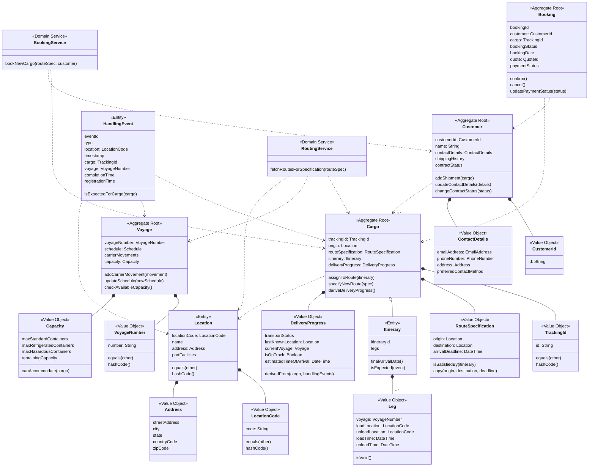

# ARD-004: Domain Model Design

## Date
2025-04-11

## Status
Proposed

## Context
Our Cargo Tracking System implements Clean Architecture and Domain-Driven Design principles across both iOS (Swift) and Android (Kotlin) platforms. A rich domain model is the foundation of our system, capturing the essential business concepts and rules of the shipping domain.

A well-designed domain model provides several benefits:
1. It creates a shared language between business and technology teams (Ubiquitous Language)
2. It encapsulates domain knowledge and business rules in a maintainable way
3. It ensures that our software accurately reflects real-world business constraints
4. It creates clear boundaries for system components
5. It provides a solid foundation for implementing complex business operations

However, designing effective domain models requires clear guidelines about:
- When to use Value Objects vs. Entities vs. Aggregates
- How to enforce invariants and business rules within the domain model
- How to structure relationships between domain objects
- How to handle identity and equality for different domain objects
- How to ensure domain objects remain focused on business concerns

Currently, our development teams have inconsistent approaches to domain modeling, leading to issues such as:
- Anemic domain models with business logic scattered across services
- Ineffective boundaries that permit direct modification of related objects
- Value objects implemented as entities with unnecessary identity
- Unclear responsibility for enforcing business rules
- Domain objects with persistence or UI concerns

## Decision
We will adopt a comprehensive approach to domain modeling with the following principles:

1. **Strategic Design Principles**
   - Identify bounded contexts with clear boundaries and responsibility
   - Establish a ubiquitous language within each context
   - Define context maps to document relationships between contexts
   - Use domain events to communicate between contexts

2. **Tactical Design Patterns**
   - Distinguish between Value Objects, Entities, and Aggregates
   - Use Value Objects for concepts defined by their attributes
   - Use Entities for concepts with identity and continuity
   - Define Aggregate boundaries for transactional consistency
   - Implement Domain Services for operations not belonging to single entities
   - Apply Domain Events for cross-aggregate communication

3. **Implementation Guidelines**
   - Enforce invariants through constructors and behavior methods
   - Make domain objects immutable where appropriate
   - Keep persistence concerns out of the domain model
   - Associate validation with the appropriate domain objects
   - Make impossible states unrepresentable through the type system
   - Use factory methods for complex object creation

## Consequences

### Positive Consequences
- **Richer Domain Logic**: Business rules are centralized in the domain model
- **Better Encapsulation**: Implementation details are hidden behind behavioral interfaces
- **Improved Maintainability**: Changes to business rules affect isolated components
- **Enhanced Communication**: Domain model represents shared understanding with business
- **More Accurate Modeling**: Better representation of real-world business constraints
- **Type Safety**: Domain concepts are represented with appropriate types
- **Transactions Boundaries**: Clear aggregate boundaries enable proper transaction scope
- **Testability**: Domain logic can be tested independently of infrastructure

### Negative Consequences
- **Learning Curve**: Requires understanding of DDD principles and patterns
- **Initial Development Time**: More upfront design is needed
- **Complexity**: Rich domain models may be more complex than anemic alternatives
- **Performance Considerations**: Rich domain models may introduce some overhead
- **Increased Code Volume**: Properly implemented domain models may require more code

## Alternatives Considered

### 1. Anemic Domain Model with Service Layer
We considered using an anemic domain model where domain objects are simple data containers and business logic resides in application services. While this approach is simpler to implement initially, it leads to scattered business logic, reduced encapsulation, and difficulty enforcing invariants.

### 2. Active Record Pattern
We considered having domain objects implement their own persistence logic (Active Record pattern). This would simplify database operations but would violate Clean Architecture principles by mixing domain and persistence concerns.

### 3. Generic Domain Objects
We considered a more generic approach to domain modeling with fewer specialized types. While this would reduce the number of classes, it would sacrifice type safety and make the code less self-documenting.

### 4. UI-Driven Domain Model
We considered letting UI requirements drive the domain model design. This approach would optimize for immediate UI needs but would result in a domain model that doesn't accurately represent the business domain.

## Rationale
The rich domain model approach aligns with the foundational principles of Domain-Driven Design and Clean Architecture. By clearly distinguishing between Value Objects, Entities, and Aggregates, we ensure that our domain model accurately represents the shipping domain while enforcing proper boundaries.

Our implementation strategy follows these key principles:

1. **Value Objects for Descriptive Concepts**:
   Value Objects are immutable objects defined by their attributes rather than an identity. We use them for concepts like TrackingId, RouteSpecification, and DeliverySpecification where the values themselves matter rather than a specific identity.

2. **Entities for Identity-Driven Concepts**:
   Entities are objects with a distinct identity that persists through state changes. Cargo, Voyage, and Customer are examples of entities in our domain since they maintain identity over time despite changes to their attributes.

3. **Aggregates for Consistency Boundaries**:
   Aggregates are clusters of entities and value objects with a single entity as the root. The aggregate root controls access to all objects within the boundary, ensuring consistent state transitions. Cargo (with its RouteSpecification, DeliveryProgress, etc.) forms an aggregate.

4. **Domain Services for Cross-Entity Operations**:
   When an operation involves multiple aggregates and doesn't naturally belong to any single entity, we implement it as a domain service. RoutingService is an example that finds possible routes for cargo across multiple voyages.

5. **Factories for Complex Object Creation**:
   When object creation involves complex logic or validation, we use factory methods or factory classes to encapsulate this logic and ensure valid object state.

6. **Domain Events for Cross-Boundary Communication**:
   To maintain aggregate boundaries while enabling communication, we use domain events. For example, when cargo is handled (HandlingEvent), we publish a CargoHandled event rather than directly modifying the Cargo aggregate.

## Implications

### For Developers
- Model domain objects according to their conceptual type (Value Object, Entity, or Aggregate)
- Keep domain objects focused on business behavior and rules
- Enforce invariants within constructors and through behavior methods
- Use factories for complex object creation
- Respect aggregate boundaries in transactions
- Validate input at the application boundary before creating domain objects
- Use domain events for cross-aggregate communication

### For Architecture
- Domain layer contains only domain objects and interfaces
- No dependencies from domain objects to infrastructure concerns
- Repository interfaces align with aggregate boundaries
- Application services orchestrate operations across multiple aggregates
- Validation occurs at both the application boundary and within domain objects

## Domain Object Classification 

### Value Objects
Value objects are immutable objects with no identity. They are defined entirely by their attributes:

- **Characteristics**:
  - Immutable (no setters or state changes after creation)
  - Equality based on attribute values, not identity
  - No persistent identity or ID fields
  - Self-validating through constructors or factory methods
  - Often used as parameters or properties of entities

- **Examples in our domain**:
  - `TrackingId` (a formatted identifier for cargo)
  - `RouteSpecification` (origin, destination, and deadline)
  - `Money` (amount and currency)
  - `LocationCode` (UN/LOCODE standard code for locations)
  - `DeliverySpecification` (special handling instructions, requirements)
  
- **Implementation guidelines**:
  - Make all properties immutable (read-only)
  - Override equality methods (equals/hashCode or ===/hashValue)
  - Validate in constructors or use factory methods
  - Include behavior methods for domain operations (e.g., temperature conversion)
  - Use value objects instead of primitive types where appropriate

### Entities
Entities are objects with a distinct identity that persists through state changes:

- **Characteristics**:
  - Mutable state that changes over time
  - Identity separate from attribute values
  - Equality based on identity (ID), not attribute values
  - Lifecycle operations that modify state
  - Enforce invariants during state changes

- **Examples in our domain**:
  - `Location` (a physical location like a port identified by code)
  - `Voyage` (a ship's journey identified by a voyage number)
  - `HandlingEvent` (an event in the cargo's history)
  - `Itinerary` (a planned route consisting of legs)
  
- **Implementation guidelines**:
  - Provide identifier attribute that remains stable over time
  - Override equality methods to compare by identity
  - Encapsulate state changes through behavior methods
  - Validate state changes against business rules
  - Keep entity focused on its core responsibility

### Aggregates
Aggregates are clusters of objects (entities and value objects) treated as a unit:

- **Characteristics**:
  - Single entity as the root that controls access
  - External references only to the aggregate root
  - Enforces consistency rules for the entire cluster
  - Transactional boundary for persistence operations
  - Publish domain events for cross-aggregate communication

- **Examples in our domain**:
  - `Cargo` aggregate (with itinerary, route specification, delivery progress)
  - `Customer` aggregate (with contact information, shipping history)
  - `Voyage` aggregate (with schedule, carrier movements, capacity)
  - `SalesContract` aggregate (with terms, pricing structure)
  
- **Implementation guidelines**:
  - Define a clear aggregate root entity
  - Reference other aggregates only by identity (not direct object reference)
  - Make non-root entities internal or private to the aggregate when possible
  - Update an aggregate in a single transaction
  - Publish domain events for significant state changes
  - Keep aggregates focused and relatively small

### Domain Services
Operations that don't naturally belong to a single entity or value object:

- **Characteristics**:
  - Stateless operations involving multiple domain objects
  - Named after a domain activity or process
  - Expresses a significant domain concept
  
- **Examples in our domain**:
  - `RoutingService` (finds routes for cargo across voyages)
  - `PricingService` (calculates prices based on routes and contracts)
  - `BookingService` (coordinates the booking process)
  
- **Implementation guidelines**:
  - Keep domain services focused on domain operations
  - Don't use services for CRUD operations
  - Inject required repositories or other services
  - Name services after domain activities or processes

### Domain Events
Significant occurrences within the domain:

- **Characteristics**:
  - Named in past tense (something that has happened)
  - Immutable and timestamped
  - May trigger processes in other bounded contexts
  
- **Examples in our domain**:
  - `CargoBooked` (when a cargo is booked)
  - `CargoHandled` (when a handling event occurs)
  - `VoyageDelayed` (when a voyage schedule changes)
  
- **Implementation guidelines**:
  - Make events immutable
  - Include timestamp and relevant identities
  - Use events for cross-aggregate communication
  - Consider event sourcing for critical business processes

## Domain Model Example

## Best Practices and Anti-Patterns

### Best Practices
1. **Design Entities Around Identity**:
   - Focus on the lifecycle and behavioral aspects of entities
   - Use identity to distinguish between entities even when their attributes are identical
   - Maintain identity consistency across system boundaries

2. **Make Value Objects Immutable**:
   - Design value objects without setters or mutable state
   - Replace value objects entirely rather than modifying them
   - Use value objects whenever possible to reduce the number of entities

3. **Define Clear Aggregate Boundaries**:
   - Identify natural consistency boundaries in the domain
   - Keep aggregates relatively small and focused
   - Use aggregate roots to control access to internal objects

4. **Validate at Appropriate Levels**:
   - Validate syntactic correctness at system boundaries (application layer)
   - Enforce domain invariants within domain objects
   - Ensure value objects can never be in an invalid state

5. **Express Domain Concepts in Code**:
   - Create types for all significant domain concepts
   - Use method names that reflect domain language
   - Structure code to mirror domain relationships

6. **Use Factories for Complex Creation**:
   - Encapsulate complex object creation in factory methods or classes
   - Validate pre-conditions during creation
   - Hide implementation details of object construction

7. **Keep Domain Layer Pure**:
   - Avoid dependencies on infrastructure or application concerns
   - Focus domain objects solely on business behavior
   - Define repository interfaces in the domain layer, implementations elsewhere

### Anti-Patterns
1. ❌ **Anemic Domain Model**:
   - Domain objects with fields but no behavior
   - Business logic implemented in services rather than domain objects
   - Objects that are little more than data containers

2. ❌ **Smart UI, Dumb Domain**:
   - Business logic embedded in UI components
   - Domain model shaped by UI requirements rather than business concepts
   - Validation performed only at the UI level

3. ❌ **Direct Aggregate Navigation**:
   - Traversing aggregates through object references rather than repository lookups
   - Exposing collections of related entities directly
   - Missing or unclear aggregate boundaries

4. ❌ **Primitive Obsession**:
   - Using primitive types (string, int, etc.) for domain concepts
   - Missing value objects for concepts like identifiers, money, quantities
   - Duplicating validation logic for the same concept

5. ❌ **Leaky Persistence**:
   - Domain objects with persistence-specific annotations or methods
   - Entity identity tied to database identity
   - Domain objects exposing database-specific fields

6. ❌ **Bloated Aggregates**:
   - Overly large aggregates containing too many entities
   - Performance issues due to loading large object graphs
   - Concurrency conflicts due to excessive aggregate scope

7. ❌ **Behavioral Inconsistency**:
   - Inconsistent enforcement of invariants
   - Some operations bypassing validation rules
   - Multiple ways to perform the same domain operation

## Related ADRs
- ARD-001: Use Case Abstraction
- ARD-002: Repository Abstraction
- ARD-003: Error Handling Strategy
- ARD-005: Domain Events
