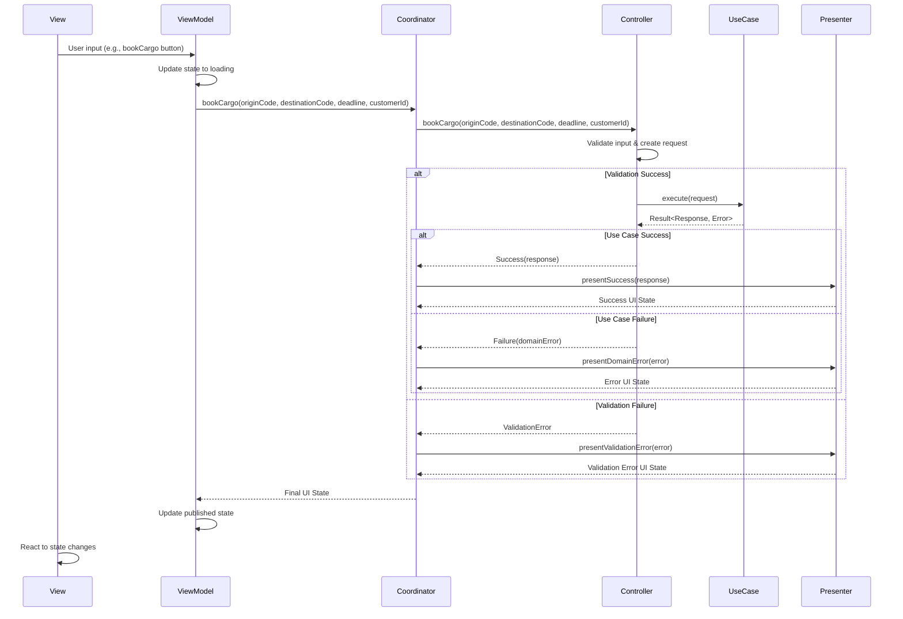

# ARD-006: Controller-Presenter Pattern

## Date
2025-04-11

## Status
Proposed

## Context
Our Cargo Tracking System implements Clean Architecture and Domain-Driven Design principles across both iOS (Swift) and Android (Kotlin) platforms. As our application grows in complexity, we need to establish clear guidelines for how the presentation layer interacts with our use cases to avoid:

1. **Bloated View Models**: View models that accumulate too many responsibilities, making them difficult to test and maintain
2. **Inconsistent Error Handling**: Varied approaches to transforming domain errors into user-friendly messages
3. **Direct Use Case Access**: UI components directly accessing use cases without proper input validation or error translation
4. **UI/Domain Logic Mixing**: Business logic leaking into UI components or UI concerns affecting domain objects
5. **Duplicate Transformation Logic**: Redundant code for transforming between UI models and domain models

We currently use MVVM (Model-View-ViewModel) as our UI architecture pattern, but we need additional structure to ensure that our view models remain focused and that the interaction with our domain layer follows Clean Architecture principles.

The Controller-Presenter pattern addresses these concerns by providing a clear separation between:
- **Input transformation and validation** (Controller responsibility)
- **Use case execution** (Controller responsibility)
- **Output transformation and formatting** (Presenter responsibility)

This pattern complements MVVM by moving use case interaction logic out of the view model, allowing the view model to focus on its core responsibilities of state management and UI binding.

## Decision
We will adopt the Controller-Presenter pattern to coordinate use case execution with the following structure:

1. **Controllers** will be responsible for:
   - Transforming UI input into use case request models
   - Validating input data before passing to use cases
   - Executing use cases
   - Capturing use case responses and errors

2. **Presenters** will be responsible for:
   - Transforming use case responses into UI models
   - Converting domain errors into user-friendly messages
   - Formatting data according to UI requirements
   - Creating appropriate UI state representations

3. **Coordinators** will serve as a bridge that:
   - Combines controller and presenter functionality
   - Encapsulates the complete use case flow
   - Provides a single point of entry for view models

4. **View Models** will be responsible for:
   - Managing UI state
   - Delegating use case execution to coordinators
   - Binding UI state to views
   - Handling UI events

## Consequences

### Positive Consequences
- **Focused Components**: Each component has a single, well-defined responsibility
- **Improved Testability**: Controllers and presenters can be tested independently
- **Consistent Error Handling**: Standardized approach to error transformation
- **Cleaner View Models**: View models delegate transformation logic to controllers and presenters
- **Better Separation of Concerns**: Clear boundaries between UI, application, and domain layers
- **Reusable Transformation Logic**: Controllers and presenters can be reused across different UI implementations
- **Simplified Maintenance**: Changes to UI formatting or domain interfaces require changes to fewer components

### Negative Consequences
- **Additional Components**: Introduces more classes to the codebase
- **Learning Curve**: Developers need to understand the responsibilities of each component
- **Potential Over-Engineering**: Simple use cases may not benefit from this level of separation
- **Coordination Overhead**: Need to manage the interaction between components
- **Abstraction Cost**: Increased abstraction may make the code flow harder to follow initially

## Alternatives Considered

### 1. Direct Use Case Execution in View Models
We considered having view models directly execute use cases without the controller-presenter separation. This approach is simpler but leads to bloated view models with mixed responsibilities for input transformation, use case execution, and output formatting.

### 2. MVP (Model-View-Presenter) Architecture
We considered switching from MVVM to MVP, where presenters would have more responsibility. However, this would require a significant architectural shift and would lose the benefits of MVVM's data binding capabilities.

### 3. VIPER Architecture
We considered the more comprehensive VIPER (View-Interactor-Presenter-Entity-Router) architecture, which includes additional components for routing. While powerful, VIPER introduces more complexity than needed for our current requirements.

### 4. Use Case Factory with Result Handlers
We considered a pattern where use case factories would create use cases with result handlers. This approach is more focused on the creation aspect but doesn't address the separation of input/output transformation concerns.

## Rationale
The Controller-Presenter pattern aligns with Clean Architecture principles by maintaining clear boundaries between layers and ensuring that dependencies point inward toward the domain layer. It complements our existing MVVM architecture by providing a structured way for view models to interact with use cases.

This pattern is particularly valuable for our cargo shipping domain, where:

1. **Complex Input Validation**: Shipping operations often require extensive validation (e.g., checking location codes, dates, capacity)
2. **Multiple Error Scenarios**: Many business operations can fail for various domain reasons that need to be translated to user-friendly messages
3. **Formatting Requirements**: Output data often needs specific formatting (dates, times, monetary values) for UI display
4. **Cross-Platform Consistency**: Both iOS and Android applications need consistent behavior despite platform differences

By separating these concerns, we can ensure that our applications behave consistently across platforms while maintaining clean architectural boundaries and testable components.

## Implications

### For Developers
- Create controllers for transforming UI input and executing use cases
- Create presenters for transforming use case output to UI models
- Use coordinators to combine controller and presenter functionality
- Keep view models focused on state management and UI binding
- Follow naming conventions for clarity (e.g., `BookCargoController`, `BookCargoPresenter`)
- Test controllers and presenters in isolation from view models and UI components

### For Architecture
- Controllers and presenters belong to the presentation layer, but sit at the boundary with the application layer
- View models delegate to coordinators rather than executing use cases directly
- Error translation happens consistently in presenters
- UI state representation is standardized through presenter output models

## Swift/Kotlin Examples

### Controller Pattern

#### Swift Controller Example

```swift
// Controller responsible for input validation and use case execution
final class BookCargoController {
    private let useCase: BookCargoUseCase
    
    init(useCase: BookCargoUseCase) {
        self.useCase = useCase
    }
    
    func bookCargo(
        originLocationCode: String,
        destinationLocationCode: String,
        arrivalDeadlineString: String,
        customerId: String
    ) async -> Result<BookCargoResponse, Error> {
        // Parse and validate date
        guard let arrivalDeadline = DateFormatter.iso8601.date(from: arrivalDeadlineString) else {
            let fieldErrors = ["arrivalDeadline": "Invalid date format. Use ISO 8601 format."]
            return .failure(ValidationError(fieldErrors: fieldErrors))
        }
        
        // Create and validate request using factory method
        let requestResult = BookCargoRequest.create(
            originLocationCode: originLocationCode,
            destinationLocationCode: destinationLocationCode,
            arrivalDeadline: arrivalDeadline,
            customerId: customerId
        )
        
        // If validation fails, return the validation error
        guard case .success(let request) = requestResult else {
            if case .failure(let validationError) = requestResult {
                return .failure(validationError)
            }
            return .failure(ValidationError(fieldErrors: ["general": "Invalid request"]))
        }
        
        // Execute use case with validated request
        return await useCase.execute(request: request)
    }
}
```

#### Kotlin Controller Example

```kotlin
// Controller responsible for input validation and use case execution
class BookCargoController(private val useCase: BookCargoUseCase) {
    
    suspend fun bookCargo(
        originLocationCode: String,
        destinationLocationCode: String,
        arrivalDeadlineString: String,
        customerId: String
    ): ControllerResult {
        // Parse and validate date
        val dateFormatter = DateTimeFormatter.ISO_DATE_TIME
        val arrivalDeadline = try {
            LocalDateTime.parse(arrivalDeadlineString, dateFormatter)
        } catch (e: Exception) {
            val fieldErrors = mapOf("arrivalDeadline" to "Invalid date format. Use ISO 8601 format.")
            return ControllerResult.ValidationError(ValidationError(fieldErrors))
        }
        
        // Create and validate request using factory method
        val requestResult = BookCargoRequest.create(
            originLocationCode = originLocationCode,
            destinationLocationCode = destinationLocationCode,
            arrivalDeadline = arrivalDeadline,
            customerId = customerId
        )
        
        // Handle validation errors or execute use case
        return when (requestResult) {
            is Result.Success -> {
                // Execute use case with validated request
                val useCaseResult = useCase.execute(requestResult.value)
                when (useCaseResult) {
                    is Result.Success -> ControllerResult.Success(useCaseResult.value)
                    is Result.Failure -> ControllerResult.DomainError(useCaseResult.error)
                }
            }
            is Result.Failure -> {
                ControllerResult.ValidationError(requestResult.error)
            }
        }
    }
    
    // Sealed class to represent different controller outcomes
    sealed class ControllerResult {
        data class Success(val response: BookCargoResponse) : ControllerResult()
        data class ValidationError(val error: ValidationError) : ControllerResult()
        data class DomainError(val error: DomainError) : ControllerResult()
    }
}
```

### Presenter Pattern

#### Swift Presenter Example

```swift
// Presenter responsible for transforming domain responses and errors to UI models
final class BookCargoPresenter {
    
    func present(response: BookCargoResponse) -> BookCargoViewState {
        return .success(
            trackingId: response.trackingId,
            successMessage: "Your cargo has been booked successfully. Use tracking ID \(response.trackingId) to track your shipment."
        )
    }
    
    func presentError(error: Error) -> BookCargoViewState {
        if let validationError = error as? ValidationError {
            return presentValidationError(error: validationError)
        } else if let domainError = error as? DomainError {
            return presentDomainError(error: domainError)
        } else {
            return .failure("An unexpected error occurred. Please try again later.")
        }
    }
    
    func presentValidationError(error: ValidationError) -> BookCargoViewState {
        return .validationFailure(fieldErrors: error.fieldErrors)
    }
    
    func presentDomainError(error: DomainError) -> BookCargoViewState {
        switch error {
        case .notFound(let message):
            if message.contains("Location") {
                return .failure("The specified port location could not be found. Please check the location code and try again.")
            } else if message.contains("Customer") {
                return .failure("Your customer account could not be found. Please contact customer support.")
            } else {
                return .failure("Required information could not be found: \(message)")
            }
            
        case .invalidOperation(let reason):
            return .failure("This operation cannot be completed: \(reason)")
            
        case .repositoryError:
            return .failure("A system error occurred while processing your booking. Please try again later.")
            
        case .unauthorized:
            return .failure("You are not authorized to perform this booking. Please log in again or contact customer support.")
            
        default:
            return .failure("An error occurred while processing your booking request.")
        }
    }
}

// UI state representation
enum BookCargoViewState {
    case idle
    case loading
    case success(trackingId: String, successMessage: String)
    case validationFailure(fieldErrors: [String: String])
    case failure(String)
}
```

#### Kotlin Presenter Example

```kotlin
// Presenter responsible for transforming domain responses and errors to UI models
class BookCargoPresenter {
    
    fun presentSuccess(response: BookCargoResponse): BookCargoUiState {
        return BookCargoUiState.Success(
            trackingId = response.trackingId,
            successMessage = "Your cargo has been booked successfully. Use tracking ID ${response.trackingId} to track your shipment."
        )
    }
    
    fun presentDomainError(error: DomainError): BookCargoUiState {
        return when (error) {
            is DomainError.EntityNotFound -> {
                when {
                    error.message.contains("Location") -> {
                        BookCargoUiState.Error("The specified port location could not be found. Please check the location code and try again.")
                    }
                    error.message.contains("Customer") -> {
                        BookCargoUiState.Error("Your customer account could not be found. Please contact customer support.")
                    }
                    else -> {
                        BookCargoUiState.Error("Required information could not be found: ${error.message}")
                    }
                }
            }
            is DomainError.InvalidOperation -> {
                BookCargoUiState.Error("This operation cannot be completed: ${error.reason}")
            }
            is DomainError.RepositoryError -> {
                BookCargoUiState.Error("A system error occurred while processing your booking. Please try again later.")
            }
            is DomainError.Unauthorized -> {
                BookCargoUiState.Error("You are not authorized to perform this booking. Please log in again or contact customer support.")
            }
            else -> {
                BookCargoUiState.Error("An error occurred while processing your booking request.")
            }
        }
    }
    
    fun presentValidationError(error: ValidationError): BookCargoUiState {
        return BookCargoUiState.ValidationFailure(error.fieldErrors)
    }
}

// UI state representation
sealed class BookCargoUiState {
    object Idle : BookCargoUiState()
    object Loading : BookCargoUiState()
    data class Success(val trackingId: String, val successMessage: String) : BookCargoUiState()
    data class ValidationFailure(val fieldErrors: Map<String, String>) : BookCargoUiState()
    data class Error(val message: String) : BookCargoUiState()
}
```

### Coordinator Pattern

#### Swift Coordinator Example

```swift
// Coordinator that combines controller and presenter functionality
final class BookCargoCoordinator {
    private let controller: BookCargoController
    private let presenter: BookCargoPresenter
    
    init(controller: BookCargoController, presenter: BookCargoPresenter) {
        self.controller = controller
        self.presenter = presenter
    }
    
    func bookCargo(
        originLocationCode: String,
        destinationLocationCode: String,
        arrivalDeadlineString: String,
        customerId: String
    ) async -> BookCargoViewState {
        // Execute controller to handle input and use case execution
        let result = await controller.bookCargo(
            originLocationCode: originLocationCode,
            destinationLocationCode: destinationLocationCode,
            arrivalDeadlineString: arrivalDeadlineString,
            customerId: customerId
        )
        
        // Transform result to view state via presenter
        switch result {
        case .success(let response):
            return presenter.present(response: response)
            
        case .failure(let error):
            return presenter.presentError(error: error)
        }
    }
}
```

#### Kotlin Coordinator Example

```kotlin
// Coordinator that combines controller and presenter functionality
class BookCargoCoordinator(
    private val controller: BookCargoController,
    private val presenter: BookCargoPresenter
) {
    
    suspend fun bookCargo(
        originLocationCode: String,
        destinationLocationCode: String,
        arrivalDeadlineString: String,
        customerId: String
    ): BookCargoUiState {
        // Execute controller to handle input and use case execution
        return when (val result = controller.bookCargo(
            originLocationCode = originLocationCode,
            destinationLocationCode = destinationLocationCode,
            arrivalDeadlineString = arrivalDeadlineString,
            customerId = customerId
        )) {
            is BookCargoController.ControllerResult.Success -> 
                presenter.presentSuccess(result.response)
                
            is BookCargoController.ControllerResult.ValidationError -> 
                presenter.presentValidationError(result.error)
                
            is BookCargoController.ControllerResult.DomainError -> 
                presenter.presentDomainError(result.error)
        }
    }
}
```

### View Model Integration

#### Swift ViewModel Integration Example

```swift
import Combine
import SwiftUI

// View model that delegates use case execution to coordinator
final class BookCargoViewModel: ObservableObject {
    @Published private(set) var state: BookCargoViewState = .idle
    
    private let coordinator: BookCargoCoordinator
    
    init(coordinator: BookCargoCoordinator) {
        self.coordinator = coordinator
    }
    
    func bookCargo(
        originLocationCode: String,
        destinationLocationCode: String,
        arrivalDeadlineString: String,
        customerId: String
    ) {
        // Update state to loading
        state = .loading
        
        // Execute use case via coordinator
        Task {
            let result = await coordinator.bookCargo(
                originLocationCode: originLocationCode,
                destinationLocationCode: destinationLocationCode,
                arrivalDeadlineString: arrivalDeadlineString,
                customerId: customerId
            )
            
            // Update UI state on main thread
            await MainActor.run {
                self.state = result
            }
        }
    }
    
    // Additional UI-related methods (form validation, field formatting, etc.)
    func isFormValid(
        originLocationCode: String,
        destinationLocationCode: String,
        arrivalDeadlineString: String,
        customerId: String
    ) -> Bool {
        return !originLocationCode.isEmpty && 
               !destinationLocationCode.isEmpty && 
               !arrivalDeadlineString.isEmpty && 
               !customerId.isEmpty &&
               originLocationCode != destinationLocationCode
    }
}
```

#### Kotlin ViewModel Integration Example

```kotlin
import androidx.lifecycle.ViewModel
import androidx.lifecycle.viewModelScope
import kotlinx.coroutines.flow.MutableStateFlow
import kotlinx.coroutines.flow.StateFlow
import kotlinx.coroutines.flow.asStateFlow
import kotlinx.coroutines.launch

// View model that delegates use case execution to coordinator
class BookCargoViewModel(
    private val coordinator: BookCargoCoordinator
) : ViewModel() {
    
    private val _uiState = MutableStateFlow<BookCargoUiState>(BookCargoUiState.Idle)
    val uiState: StateFlow<BookCargoUiState> = _uiState.asStateFlow()
    
    fun bookCargo(
        originLocationCode: String,
        destinationLocationCode: String,
        arrivalDeadlineString: String,
        customerId: String
    ) {
        // Update state to loading
        _uiState.value = BookCargoUiState.Loading
        
        // Execute use case via coordinator
        viewModelScope.launch {
            val result = coordinator.bookCargo(
                originLocationCode = originLocationCode,
                destinationLocationCode = destinationLocationCode,
                arrivalDeadlineString = arrivalDeadlineString,
                customerId = customerId
            )
            
            // Update UI state
            _uiState.value = result
        }
    }
    
    // Additional UI-related methods (form validation, field formatting, etc.)
    fun isFormValid(
        originLocationCode: String,
        destinationLocationCode: String,
        arrivalDeadlineString: String,
        customerId: String
    ): Boolean {
        return originLocationCode.isNotEmpty() && 
               destinationLocationCode.isNotEmpty() && 
               arrivalDeadlineString.isNotEmpty() && 
               customerId.isNotEmpty() &&
               originLocationCode != destinationLocationCode
    }
}
```

### Dependency Injection

#### Swift Dependency Injection Example

```swift
// Factory to create controller-presenter-coordinator chain with proper dependencies
final class CoordinatorFactory {
    private let useCaseFactory: UseCaseFactory
    
    init(useCaseFactory: UseCaseFactory) {
        self.useCaseFactory = useCaseFactory
    }
    
    func makeBookCargoCoordinator() -> BookCargoCoordinator {
        let useCase = useCaseFactory.makeBookCargoUseCase()
        let controller = BookCargoController(useCase: useCase)
        let presenter = BookCargoPresenter()
        
        return BookCargoCoordinator(
            controller: controller,
            presenter: presenter
        )
    }
}

// Composition Root / Dependency Container
final class AppDependencyContainer {
    private let apiClient: APIClient
    private let database: CoreDataStack
    
    private lazy var repositories: RepositoryFactory = {
        return RepositoryFactory(apiClient: apiClient, database: database)
    }()
    
    private lazy var useCaseFactory: UseCaseFactory = {
        return UseCaseFactory(repositories: repositories)
    }()
    
    private lazy var coordinatorFactory: CoordinatorFactory = {
        return CoordinatorFactory(useCaseFactory: useCaseFactory)
    }()
    
    init(apiClient: APIClient, database: CoreDataStack) {
        self.apiClient = apiClient
        self.database = database
    }
    
    func makeBookCargoViewModel() -> BookCargoViewModel {
        let coordinator = coordinatorFactory.makeBookCargoCoordinator()
        return BookCargoViewModel(coordinator: coordinator)
    }
}
```

#### Kotlin Dependency Injection with Hilt Example

```kotlin
// Hilt Module for providing controllers, presenters and coordinators
@Module
@InstallIn(ViewModelComponent::class)
object CoordinatorModule {
    
    @Provides
    fun provideBookCargoController(
        bookCargoUseCase: BookCargoUseCase
    ): BookCargoController {
        return BookCargoController(bookCargoUseCase)
    }
    
    @Provides
    fun provideBookCargoPresenter(): BookCargoPresenter {
        return BookCargoPresenter()
    }
    
    @Provides
    fun provideBookCargoCoordinator(
        controller: BookCargoController,
        presenter: BookCargoPresenter
    ): BookCargoCoordinator {
        return BookCargoCoordinator(controller, presenter)
    }
}

// ViewModel with Hilt injection
@HiltViewModel
class BookCargoViewModel @Inject constructor(
    private val coordinator: BookCargoCoordinator
) : ViewModel() {
    // Implementation as shown above
}
```

## Component Responsibilities Summary

### Controller
- **Responsibility**: Transform UI input into use case requests and execute use cases
- **Inputs**: Primitive UI data types (strings, dates, etc.)
- **Outputs**: Use case responses or errors wrapped in a Result type
- **Decision Making**: Input validation, request creation
- **Dependencies**: Use case

### Presenter
- **Responsibility**: Transform use case responses and errors into UI models
- **Inputs**: Use case responses, domain errors, validation errors
- **Outputs**: UI state models ready for display
- **Decision Making**: Error categorization, message formatting, data formatting
- **Dependencies**: None (pure transformation logic)

### Coordinator
- **Responsibility**: Orchestrate the flow between controller and presenter
- **Inputs**: Primitive UI data types
- **Outputs**: UI state models
- **Decision Making**: Routing between controller and presenter based on results
- **Dependencies**: Controller, presenter

### View Model
- **Responsibility**: Manage UI state and handle UI events
- **Inputs**: UI events
- **Outputs**: Observable UI state
- **Decision Making**: UI-specific logic, state updates
- **Dependencies**: Coordinator

## Sequence Flow



## Best Practices and Anti-Patterns

### Best Practices

1. **Clear Component Responsibilities**:
   - Controllers handle input transformation and use case execution
   - Presenters handle output transformation and error formatting
   - Coordinators orchestrate the flow between controllers and presenters
   - View models focus on state management and UI binding

2. **Use Case Focused Organization**:
   - Group controller, presenter, and coordinator components by use case
   - Name components after the use case they handle (e.g., `BookCargoController`)
   - Keep component interfaces focused on their specific use case

3. **Consistent Error Handling**:
   - Validate input in controllers before executing use cases
   - Transform domain errors to user-friendly messages in presenters
   - Return detailed validation errors for form fields
   - Provide actionable error messages that guide users to solutions

4. **UI State Representation**:
   - Define clear UI state models that represent all possible view states
   - Use enums/sealed classes to model state transitions
   - Include loading states, success states, and error states
   - Make state immutable to prevent inconsistencies

5. **Testability**:
   - Test controllers with mock use cases
   - Test presenters with predefined responses and errors
   - Test coordinators with mock controllers and presenters
   - Use dependency injection to provide test doubles

### Anti-Patterns

1. ❌ **Bloated View Models**:
   - View models that perform input validation, use case execution, and output formatting
   - View models with direct references to use cases or repositories
   - Complex transformation logic embedded in view models

2. ❌ **Controller-Presenter Overlap**:
   - Controllers that format output data for display
   - Presenters that validate input data
   - Components with mixed responsibilities

3. ❌ **Missing Coordinators**:
   - View models that handle controller and presenter responsibilities
   - Direct dependencies between view models and controllers/presenters
   - Duplicate orchestration logic across view models

4. ❌ **Leaking Domain Concepts**:
   - Exposing domain objects or errors directly to the UI
   - UI components that understand domain error types
   - View models that depend on domain-specific knowledge

5. ❌ **UI Logic in Presenters**:
   - Presenters that reference platform-specific UI components
   - Presenters with animation or transition logic
   - Platform-specific formatting embedded in presenters

6. ❌ **Domain Logic in Controllers**:
   - Controllers that implement business rules
   - Controllers that bypass use cases for certain operations
   - Controllers that maintain domain state

7. ❌ **Inconsistent Error Handling**:
   - Different error representations across presenters
   - Direct exposure of exception messages to users
   - Missing validation for some inputs

## Related ADRs
- ARD-001: Use Case Abstraction
- ARD-003: Error Handling Strategy
- ARD-004: Domain Model Design
